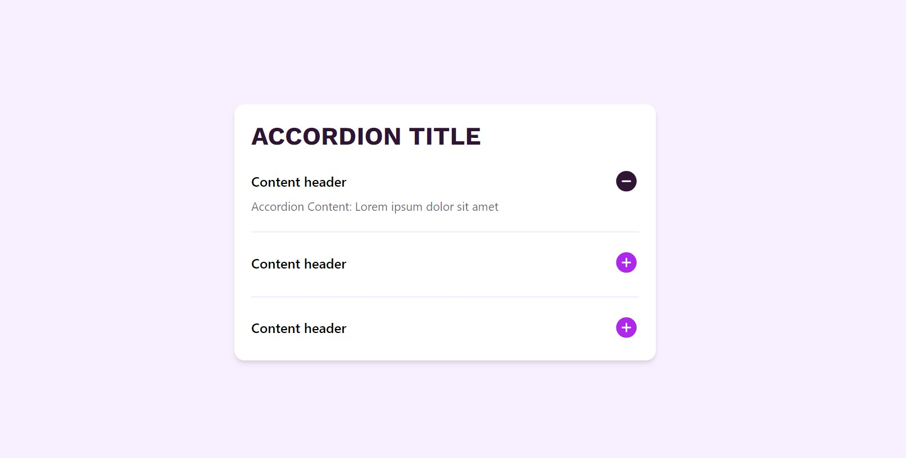

# FAQ Accordion

### The challenge
The users should be able to: 

- Hide/Show the answer to a question when the question is clicked
- Navigate the questions and hide/show answers using keyboard navigation alone
- View the optimal layout for the interface depending on their device's screen size
- See hover and focus states for all interactive elements on the page

### Basic Usage:

```react

    <Accordion.Root>
        <Accordion.Title />
        <Accordion.Items>
            <Accordion.Header showIcon={true} />
            <Accordion.Content />
        </Accordion.Items>
    </Accordion.Root>
```

### Image

    